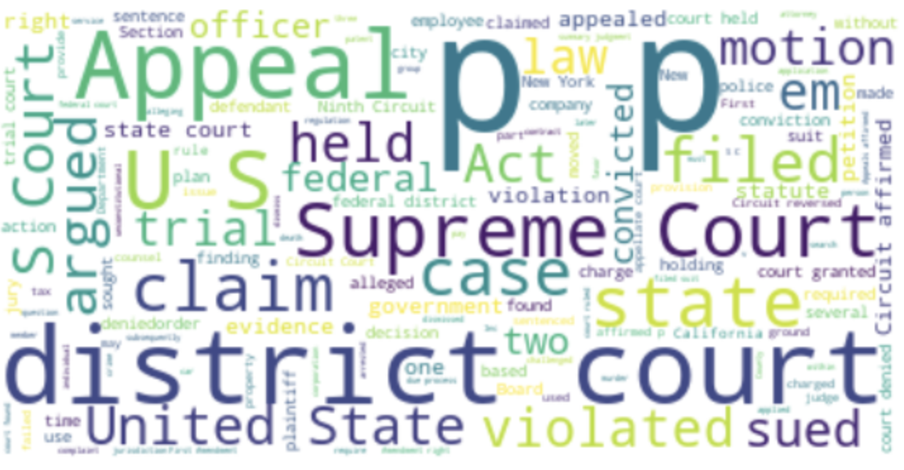

# AutoJudge(MVP)
## Goal :
- The primary goal of the project is to predict the outcome of the case

## Workflow:

- EDA, to find anomalies in the data such as nulls
- Remove stop words , Remove HTML tags and URLs from a string , Remove the most frequent words , Remove numbers and characters
- Feature identification 
- Feature Extraction

## Findings

- The above figure shows the most used words
